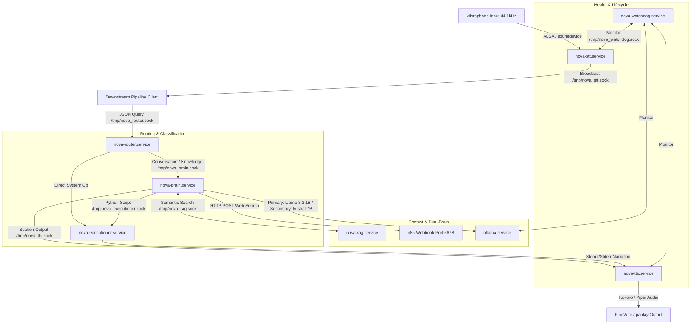

# NOVA OS — Pipeline Architecture Reference

NOVA is a modular, multi-service voice assistant operating as a set of resident user-space daemons on Arch Linux (PhoenixDragon). These services communicate asynchronously using Unix domain sockets (`/tmp/nova_*.sock`) with newline-terminated JSON payloads.

---

## 1. System Topology

Below is the socket communication and data-flow map:



---

## 2. Resident Services (The 7 Daemons)

All services run as user-level systemd daemons under `systemctl --user`.

| Unit Name | Executable Script | Unix Socket Location | Memory Max | Purpose |
| :--- | :--- | :--- | :--- | :--- |
| **`nova-stt.service`** | `~/nova/daemons/stt_daemon.py` | `/tmp/nova_stt.sock` (Listen) | `1.5 GB` | Continuous Wake Word + VAD + Live Streaming Speech-to-Text |
| **`nova-router.service`** | `~/nova/router/router_bridge.py` | `/tmp/nova_router.sock` (Listen) | `1.2 GB` | Intent Classification (DeBERTa model) |
| **`nova-brain.service`** | `~/nova/brain/brain.py` | `/tmp/nova_brain.sock` (Listen) | `512 MB` | LLM Orchestrator (Ollama, System Snapshot, Context Ingestion) |
| **`nova-executioner.service`**| `~/nova/executioner/executioner.py` | `/tmp/nova_executioner.sock` (Listen)| `256 MB` | Sandboxed python script executor |
| **`nova-tts.service`** | `~/nova/daemons/tts_daemon.py` | `/tmp/nova_tts.sock` (Listen) | `1.6 GB` | Speech Synthesis (Kokoro-82M / Piper ONNX fallback) |
| **`nova-rag.service`** | `~/nova/daemons/rag_daemon.py` | `/tmp/nova_rag.sock` (Listen) | `N/A` | Indexes `chat.jsonl` via SQLite FTS5 for context retrieval |
| **`nova-watchdog.service`** | `~/nova/watchdog/watchdog.py` | `/tmp/nova_watchdog.sock` (Listen)| `N/A` | RAM guard, health supervisor, chat log rotation |

---

## 3. End-to-End Pipeline Stages

### 1. Audio Capture & Wake Word
* **Wake State**: `stt_daemon.py` keeps the PipeWire microphone input open. It captures audio at `RECORD_RATE = 44100` Hz, downsamples it to `16000` Hz, and streams chunks to `openwakeword` using the `hey_jarvis_v0.1.onnx` model.
* **Trigger**: When the model output exceeds confidence threshold `0.5`, it broadcasts `{"type": "wake"}` to all connected clients and enters recording mode.

### 2. Speech-to-Text (STT) & VAD
* **Voice Activity Detection (VAD)**: Multi-feature VAD segments speech using:
  1. *Broadband Energy*: Pre-gates obvious silence.
  2. *Voice-band RMS*: Isolates energy in the human voice range (300-3400 Hz).
  3. *Zero-Crossing Rate (ZCR)*: Rejects high-frequency tonal noise (hiss/hum).
  4. *Spectral Centroid*: Filters flat broadband noise (fans/hiss).
* **Live Streaming**: Rolling audio is cleaned, normalized, and transcribed every 1.5 seconds using `faster-whisper` (running locally on CPU). Partial results are broadcast as `{"type": "partial", "text": "..."}`.
* **Final Capture**: When silence is sustained for `2.0` seconds (or `30s` cap is hit), a high-accuracy transcription (beam size 5) runs, broadcasting `{"type": "final", "text": "..."}`.

### 3. Intent Classification (Router Bridge)
* When a pipeline client forwards the final text to `/tmp/nova_router.sock`, `router_bridge.py` feeds it to a fine-tuned DeBERTa model (`~/models/nova-router-v2`).
* The classifier returns one of **7 intents**:
  1. `browser_op` — Browser actions (open websites)
  2. `system_op` — System operations (volume, brightness, power)
  3. `media_op` — Media control (playback)
  4. `file_op` — File interactions (open, delete, convert)
  5. `knowledge_query` — General knowledge questions
  6. `conversation` — Chit-chat / interactive dialogue
  7. `time_query` — Date/time checks
* **Routing Decisions**:
  * If the intent is `system_op` with confidence $\ge 80\%$, it checks for exact matches (e.g., "volume up" $\rightarrow$ `wpctl set-volume @DEFAULT_AUDIO_SINK@ 5%+`) and bypasses the brain, sending the payload directly to `/tmp/nova_executioner.sock`.
  * For all other queries (or low confidence classification), it sends the query to `/tmp/nova_brain.sock`.

### 4. LLM Orchestration & Context Ingestion (Brain)
Upon receiving a query, `brain.py` collects live environment context before querying Ollama:
* **User Profile**: Loads static context (name, interests, key project locations) from `~/nova/memory/user_profile.json`.
* **RAG Retrieval**: Queries `rag_daemon.py` asynchronously via `/tmp/nova_rag.sock` to retrieve top-K relevant past dialogue snippets.
* **N8N Web RAG**: If time-sensitive keywords ("news", "price", "weather", "today") are matched, the brain queries the localhost N8N webhook (`/webhook/nova-web-search`) to fetch live search summaries.
* **System Snapshot**: Executes safe, read-only system inspection commands:
  * Hyprland window information (`hyprctl activewindow` & `hyprctl clients`)
  * CPU, Memory, and Disk metrics via `psutil`
  * Default audio sink volume (`wpctl`)
  * Network route interfaces (`ip route`)
  * System/GPU temperatures via `sensors`

### 5. Dual-Brain Model Selection (`llm_router.py`)
To prevent GPU/CPU thrashing on a local machine, queries are routed dynamically:
1. **Primary Model (`llama3.2:1b`)**: Used for operations (`browser_op`, `system_op`, etc.), short conversational prompts, and simple queries. It answers in 2–5s.
2. **Secondary Model (`mistral:7b-instruct-q4_K_M`)**: Used for complex queries (scientific/coding questions, essays, summaries), query lengths $> 80$ characters, or when web search context is injected.
* **Escalation Trigger**: If `llama3.2:1b` finishes its response with `[UNSURE]`, `brain.py` automatically escalates the query to `mistral:7b-instruct-q4_K_M` for a more thorough analysis.

### 6. Sandboxed Execution (Executioner)
When the LLM outputs executable python code (wrapped in a standard Markdown code block) or the intent is a direct operation, the script is sent to `/tmp/nova_executioner.sock`:
* **Static Analysis**: `executioner.py` performs string matching against a banned keyword list (e.g., `rm -rf /`, `mkfs`) and blocks writes to critical system paths (`/etc/`, `/boot/`, `/sys/`, `/proc/`).
* **Permissions Verification**: Checks requested permissions (`permissions.json`) across three tiers:
  * *Tier 1 (Auto-Approved)*: Safe operations (audio controls, calculations, reading allowed logs, temp workspace writes). Executed silently.
  * *Tier 2 (Narrated)*: Browser launches, document writes, clipboard reads. The system speaks the action to the user before running.
  * *Tier 3 (User Confirmation)*: Service modifications, package installations, deletions, writes outside safe paths. Requires a verbal confirmation (yes/no) from the user.
* **Compositor Passthrough**: The executioner automatically sets key Wayland/Hyprland environment variables (e.g., `WAYLAND_DISPLAY=wayland-1`, `XDG_SESSION_TYPE=wayland`, `DBUS_SESSION_BUS_ADDRESS`) so GUI applications run seamlessly.
* **Execution**: Runs the python script in `~/nova/workspace/` and appends execution results to `exec_history.jsonl`.

### 7. Speech Synthesis (TTS)
* Clients send spoke text JSON to `/tmp/nova_tts.sock`.
* **Priority Queue**: Audio playback is organized by importance:
  * Priority 0: Instant background notifications (does not interrupt user speech).
  * Priority 1: Conversational results (synthesized and spoken in order).
* **Synthesis Engine**: Uses `Kokoro` internally with the British male voice `bm_lewis`.
* **Volume Amplification**: Direct numpy array scaling: `audio_out = np.clip(audio_out * 1.5, -1.0, 1.0)` boosts the volume by $+50\%$ without clipping.
* **Fallback**: If Kokoro fails, it defaults to Piper-TTS (`ryan-medium.onnx`) and scales the audio using `sox` or PipeWire volume properties.

---

## 4. Socket Payload Specifications

### 1. STT Daemon Broadcast
**Path**: `/tmp/nova_stt.sock` (Listen)
```json
// Event: Wake word detected
{"type": "wake"}

// Event: Streaming partial transcript
{"type": "partial", "text": "open you"}

// Event: Voice finalized
{"type": "final", "text": "open youtube"}
```

### 2. Router Request
**Path**: `/tmp/nova_router.sock` (Listen)
```json
{"query": "open youtube", "transcript": "open youtube"}
```

### 3. Brain Request
**Path**: `/tmp/nova_brain.sock` (Listen)
```json
{
  "query": "how is chocolate made",
  "intent": "knowledge_query",
  "confidence": 0.98
}
```

### 4. RAG Daemon Query
**Path**: `/tmp/nova_rag.sock` (Listen)
```json
{"query": "how is chocolate made", "top_k": 3}
```
**RAG Daemon Response**:
```json
{
  "hit": true,
  "context": "[User profile]\n• Name: Tathya\n• Role: Lead Developer\n\n[Recalled memories]\n• [2026-06-05 22:19] You: how is chocolate made\n  NOVA: Chocolate making involves several stages including fermentation, roasting...",
  "memories": [
    {
      "id": "test_session_1780678140",
      "timestamp": "2026-06-05T22:19:00",
      "intent": "knowledge_query",
      "user": "how is chocolate made",
      "reply": "Chocolate making involves several stages...",
      "tags": "chocolate made",
      "score": 0.12
    }
  ],
  "count": 1
}
```

### 5. N8N Web Search Webhook
**Endpoint**: `POST http://localhost:5678/webhook/nova-web-search`
**Headers**: `X-N8N-API-KEY: <n8n_API_key>`
```json
{
  "query": "what is the current price of gold",
  "mode": "search",
  "url": ""
}
```
**Webhook Response**:
```json
{
  "summary": "As of today, gold is trading at approximately $2,380 per ounce, showing a steady rise due to market inflation hedges."
}
```

### 6. Executioner Execution Request
**Path**: `/tmp/nova_executioner.sock` (Listen)
```json
{
  "action": "execute",
  "script": "import subprocess\nsubprocess.Popen(['xdg-open', 'https://www.youtube.com'])",
  "operations": ["open_browser"],
  "narration": "Opening YouTube for you, sir."
}
```
**Executioner Response**:
```json
{
  "script_id": "fa090da8",
  "tier": 2,
  "timestamp": "2026-06-05T22:38:44.689412",
  "script": "import subprocess\n...",
  "stdout": "Opening in existing browser session.",
  "stderr": "",
  "returncode": 0,
  "success": true,
  "duration_ms": 834
}
```

### 7. TTS Request
**Path**: `/tmp/nova_tts.sock` (Listen)
```json
{"priority": 1, "text": "Opening YouTube for you, sir."}
```

---

## 5. End-to-End Walkthrough Examples

### Example 1: Operation Intent ("open youtube")

1. **Trigger**: The user says: *"Hey Jarvis... open youtube"*
2. **STT Processing**:
   * `stt_daemon.py` detects `"Hey Jarvis"` wake word. Broadcasts `{"type": "wake"}`.
   * Multi-feature VAD triggers. `faster-whisper` transcribes audio streams.
   * `stt_daemon.py` broadcasts `{"type": "final", "text": "open youtube"}`.
3. **Intent Classification**:
   * A client script pipes `"open youtube"` to `/tmp/nova_router.sock`.
   * `router_bridge.py` DeBERTa classifier outputs: `browser_op` (Confidence: `64.06%`).l
   * Because the confidence is below the threshold (`80%`), it avoids direct system execution and escalates to the brain to determine context.
4. **Brain Processing**:
   * `brain.py` receives the query over `/tmp/nova_brain.sock`.
   * Queries the RAG socket (returns Tathya's profile details).
   * Gathers System Snapshot (e.g., active window: `foot` terminal, CPU usage: `2%`).
   * Decides LLM model: `browser_op` intent routes to the fast **Primary Model (`llama3.2:1b`)**.
   * Calls Ollama. Llama 3.2 1B generates the Python script:
     ```python
     import subprocess
     subprocess.Popen(['xdg-open', 'https://www.youtube.com'])
     ```
     And spoken text: `"Opening YouTube for you, sir."`
5. **Execution**:
   * `brain.py` sends the script to `/tmp/nova_executioner.sock` with `"operations": ["open_browser"]`.
   * `executioner.py` determines the script is Tier 2 (Open Browser requires narration).
   * The executioner sends spoken text `"Opening YouTube for you, sir."` to `/tmp/nova_tts.sock` so the user is informed.
   * `executioner.py` writes the script to a temp file, merges Hyprland displays (`DISPLAY=:1`, `WAYLAND_DISPLAY=wayland-1`), and executes it. `xdg-open` launches the browser.
6. **Audio Output**:
   * `tts_daemon.py` receives conversational text `"Opening YouTube for you, sir."` (p1).
   * Synthesizes audio using Kokoro with `bm_lewis`, multiplies signal by `1.5` for volume boost, and streams to speakers via PipeWire.

---

### Example 2: Knowledge Query ("how is chocolate made")

1. **Trigger**: User says: *"how is chocolate made"*
2. **STT Processing**:
   * `stt_daemon.py` finalizes STT: `"how is chocolate made"`.
3. **Intent Classification**:
   * `router_bridge.py` DeBERTa classifies query: `knowledge_query` (Confidence: `98.05%`).
   * Routes the query straight to the brain.
4. **Brain Processing**:
   * `brain.py` queries `/tmp/nova_rag.sock`.
   * **RAG Match**: The DB finds a previous match from `chat.jsonl`. Recalls that chocolate was discussed earlier.
   * Gathers system metrics.
   * **LLM Model Decision**: The complexity router detects no time-sensitive keywords, but the query is routed to **Secondary Model (`mistral:7b-instruct-q4_K_M`)** because of complex keyword indicators (`how is`).
   * mistral-7b is queried. It reviews the injected RAG history and outputs:
     *"Chocolate making involves several stages including fermentation, roasting, winnowing... [CONFIDENT]"*
5. **Audio Output**:
   * The spoken response is sent to `/tmp/nova_tts.sock` and outputted via Kokoro.

---

### Example 3: Web-Dependent Query ("what is the current price of gold")

1. **Trigger**: User says: *"what is the current price of gold"*
2. **STT & Classification**:
   * STT outputs: `"what is the current price of gold"`.
   * Router classifies as: `knowledge_query` (Confidence: `99.1%`).
3. **Brain & Web RAG Integration**:
   * `brain.py` parses the query and matches the keyword `"current"` from `TIME_SENSITIVE_KEYWORDS`.
   * Before running the LLM, the brain calls `trigger_web_rag()`:
     * Dispatches `POST` request to `http://localhost:5678/webhook/nova-web-search` with `query: "what is the current price of gold"`.
     * N8N workflow executes a DuckDuckGo search, scrapes price indices, summarizes the text, and returns:
       `"Gold is currently trading at $2,380/oz."`
   * **Dual-Brain Model Decision**: Because `has_web_context` is true, the LLM router bypasses Llama 1B and selects **Secondary Model (`mistral:7b-instruct-q4_K_M`)**.
   * Mistral receives the N8N web context inside the system prompt and synthesizes a concise, natural response:
     *"Sir, gold is currently trading at approximately two thousand three hundred and eighty dollars per ounce."*
4. **Audio Output**:
   * Sent to `/tmp/nova_tts.sock` and played to the user.
