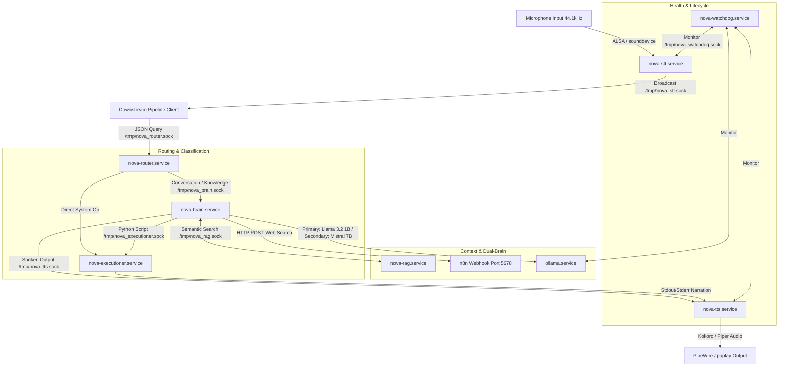

# NOVA AI

NOVA is a modular, multi-service voice assistant operating as a set of resident user-space daemons on Arch Linux (PhoenixDragon). These services communicate asynchronously using Unix domain sockets (`/tmp/nova_*.sock`) with newline-terminated JSON payloads.

## 🧠 Visual Architecture

Below is the socket communication and data-flow map of the NOVA OS Pipeline:

## 📂 Complete Project Structure

- **`/brain`**: LLM Orchestrator (`brain.py`), manages context ingestion, user profiles, system snapshots, and routes queries to Ollama models.
- **`/daemons`**: Contains the core background resident services (e.g., `stt_daemon.py`, `tts_daemon.py`, `rag_daemon.py`).
- **`/executioner`**: Sandboxed Python script executor (`executioner.py`), handles permissions and static analysis before executing LLM-generated code.
- **`/router`**: Intent classification and routing module (`router_bridge.py`), uses a fine-tuned DeBERTa model to classify user intents.
- **`/memory`**: Static context storage, including user profiles (`user_profile.json`).
- **`/watchdog`**: System monitor (`watchdog.py`), oversees RAM usage, daemon health, and handles chat log rotation.
- **`/n8n_templates`**: Workflows for N8N Webhooks used in Web RAG.
- **`/logs`**: Execution and chat logs (`chat.jsonl`, `exec_history.jsonl`).
- **`/workspace`**: Temporary workspace for script execution by the executioner daemon.
- **`/Stt&tts`**, **`/tts`**, **`/wakeword`**: Speech-to-text, text-to-speech, and wake word related models and scripts.

## ⚙️ Resident Services

All services run as user-level systemd daemons under `systemctl --user`.

| Unit Name | Executable Script | Purpose |
| :--- | :--- | :--- |
| **`nova-stt.service`** | `daemons/stt_daemon.py` | Continuous Wake Word + VAD + Live Streaming Speech-to-Text |
| **`nova-router.service`** | `router/router_bridge.py` | Intent Classification (DeBERTa model) |
| **`nova-brain.service`** | `brain/brain.py` | LLM Orchestrator (Ollama, System Snapshot, Context Ingestion) |
| **`nova-executioner.service`**| `executioner/executioner.py` | Sandboxed python script executor |
| **`nova-tts.service`** | `daemons/tts_daemon.py` | Speech Synthesis (Kokoro-82M / Piper ONNX fallback) |
| **`nova-rag.service`** | `daemons/rag_daemon.py` | Indexes `chat.jsonl` via SQLite FTS5 for context retrieval |
| **`nova-watchdog.service`** | `watchdog/watchdog.py` | RAM guard, health supervisor, chat log rotation |

*For more detailed specifications on socket payloads and execution walkthroughs, please refer to [`ARCHITECTURE.md`](ARCHITECTURE.md).*
