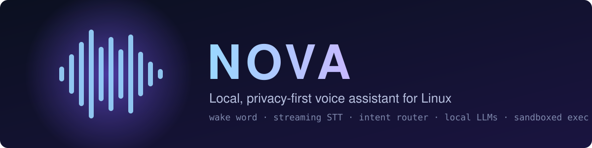
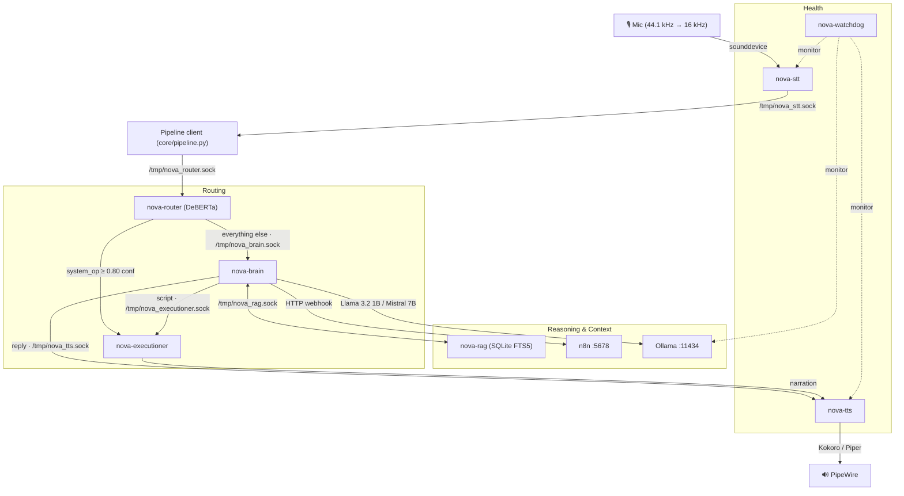

<p align="center">
  
</p>

<p align="center">
  
  
  
  
  
  
  
  
</p>

# NOVA AI

NOVA is a modular, fully local voice assistant built as a set of resident user-space daemons on Arch Linux. Each service is an independent `systemd --user` unit, and they talk to each other over Unix domain sockets (`/tmp/nova_*.sock`) using newline-terminated JSON.

Say the wake word, ask a question or give a command, and NOVA transcribes it, classifies the intent, answers with a local LLM or runs a sandboxed script, then speaks the result back.

## ✨ Highlights

- 🎙️ **Always-on wake word**: openWakeWord with energy-based VAD and streaming Whisper transcription.
- 🧭 **Intent router**: a fine-tuned DeBERTa-v3 classifier sends each request to the right place across 7 intents.
- 🧠 **Two local models**: Llama 3.2 1B for fast replies, Mistral 7B (Q4_K_M) for harder questions, both served by Ollama.
- 📚 **Conversation memory**: chat history indexed with SQLite FTS5 and fed back as context.
- 🛡️ **Sandboxed execution**: LLM-written scripts go through static analysis and a 3-tier permission model before they run.
- 🔊 **Natural speech**: Kokoro-82M TTS, with Piper ONNX as a fallback.
- 🐕 **Self-supervising**: a watchdog enforces a RAM floor, health-checks the daemons and rotates logs.

## 🧠 Architecture



See [`ARCHITECTURE.md`](ARCHITECTURE.md) for socket payload formats and a full walkthrough of each stage.

## ⚙️ Resident Services

| Unit | Script | Socket | `MemoryMax` | Role |
| :--- | :--- | :--- | :---: | :--- |
| `nova-stt` | `daemons/stt_daemon.py` | `/tmp/nova_stt.sock` | 1 GB | Wake word, VAD, streaming speech-to-text |
| `nova-router` | `router/router_bridge.py` | `/tmp/nova_router.sock` | 1.2 GB | Intent classification and routing |
| `nova-brain` | `brain/brain.py` | `/tmp/nova_brain.sock` | 512 MB | LLM orchestration, context and RAG injection |
| `nova-executioner` | `executioner/executioner.py` | `/tmp/nova_executioner.sock` | 256 MB | Sandboxed script execution |
| `nova-tts` | `daemons/tts_daemon.py` | `/tmp/nova_tts.sock` | 512 MB | Speech synthesis |
| `nova-rag` | `daemons/rag_daemon.py` | `/tmp/nova_rag.sock` | — | Chat-history indexing and retrieval |
| `nova-watchdog` | `watchdog/watchdog.py` | `/tmp/nova_watchdog.sock` | 256 MB | RAM guard, health checks, log rotation |

## 📋 Specs

<details open>
<summary><b>🎙️ Speech-to-text</b> (<code>daemons/stt_daemon.py</code>)</summary>

| Setting | Value |
| :--- | :--- |
| Wake word | openWakeWord (`hey_jarvis_v0.1.onnx`), threshold `0.5` |
| Capture rate | 44.1 kHz, resampled to 16 kHz |
| VAD | 30 ms frames, energy threshold `500`, 2.0 s silence timeout, 30 s max utterance |
| ASR | faster-whisper `base` |
| Streaming | 1.5 s chunks with a 6 s rolling context |

</details>

<details>
<summary><b>🧭 Intent router</b> (<code>router/</code>)</summary>

| Setting | Value |
| :--- | :--- |
| Model | DeBERTa-v3-base, fine-tuned (`~/models/nova-router-v2`) |
| Intents | `browser_op`, `system_op`, `media_op`, `file_op`, `conversion_op`, `knowledge_query`, `conversation` |
| Direct-exec threshold | `system_op` at ≥ 80% confidence goes straight to the executioner |
| Multi-intent | Compound requests are split on conjunctions and routed separately |
| Training data | `router/dataset_v2.json` (389 labelled examples) |

</details>

<details>
<summary><b>🧠 Brain</b> (<code>brain/</code>)</summary>

| Setting | Value |
| :--- | :--- |
| Primary model | `llama3.2:1b` (fast, roughly 2–5 s) |
| Secondary model | `mistral:7b-instruct-q4_K_M` (thorough, roughly 15–30 s) |
| Backend | Ollama at `http://127.0.0.1:11434` |
| Web search / records | n8n webhooks `/webhook/nova-web-search`, `/webhook/nova-personal-records` |
| Memory | `memory/user_profile.json` plus RAG context from `nova-rag` |

</details>

<details>
<summary><b>🛡️ Executioner</b> (<code>executioner/</code>)</summary>

Scripts are checked against `executioner/permissions.json` before running:

| Tier | Behaviour | Timeout |
| :--- | :--- | :---: |
| `tier1_auto` | Runs silently when it only uses allowed modules and write paths | 30 s |
| `tier2_narrate` | Auto-approved but announced through TTS (browser, notifications, clipboard) | 60 s |
| `tier3_confirm` | Needs a spoken "yes" first (deletes, package installs, system config) | 120 s |
| banned | Always blocked (`rm -rf /`, `mkfs`, `dd if=`, fork bombs) | — |

Scripts run in `~/nova/workspace/`, and every run is logged to `logs/exec_history.jsonl`.

</details>

<details>
<summary><b>🔊 Text-to-speech</b> (<code>daemons/tts_daemon.py</code>)</summary>

| Setting | Value |
| :--- | :--- |
| Primary | Kokoro-82M, voice `bm_lewis` (British English), speed 1.0 |
| Fallback | Piper `en_US-ryan-medium.onnx` (`en_US-lessac-medium` also included) |
| Output | PipeWire, +50% gain |

</details>

<details>
<summary><b>🐕 Watchdog</b> (<code>watchdog/</code>)</summary>

| Setting | Value |
| :--- | :--- |
| RAM floor | 3 GB available at all times (warns TTS below 5 GB) |
| Health check | Every 15 s |
| Log rotation | Chat log rotated at 50 MB |
| CLI | `watchdog/nova-ctl.py` |

</details>

## 📂 Project Structure

```text
NOVA_AI/
├── brain/           # LLM orchestrator (brain.py) and model selection (llm_router.py)
├── core/            # Shared audio helpers and the pipeline client
├── daemons/         # STT, TTS and RAG resident services
├── executioner/     # Sandboxed executor and permissions.json
├── router/          # DeBERTa intent classifier: training, datasets, bridge
├── watchdog/        # Health supervisor and nova-ctl
├── memory/          # User profile and RAG database
├── n8n_templates/   # n8n workflows (web search, personal records, browser automation)
├── tts/             # Piper ONNX voices
├── wakeword/        # Wake word training samples (positive and negative)
├── Stt&tts/         # Earlier STT/TTS daemons and install_daemons.sh
├── logs/            # Service logs, chat.jsonl, exec_history.jsonl
└── workspace/       # Scratch directory for executed scripts
```

## 🚀 Getting Started

> [!NOTE]
> The unit files and several constants currently use absolute paths under `/home/tathya/nova`. The audio device indices (`MIC_DEVICE_IDX`, `SPEAKER_SINK`) are also set for one specific machine. Update both before running NOVA anywhere else.

1. **Prerequisites**: Python 3.14, [Ollama](https://ollama.com), PipeWire, and optionally a local [n8n](https://n8n.io) instance.
2. **Pull the models**
   ```bash
   ollama pull llama3.2:1b
   ollama pull mistral:7b-instruct-q4_K_M
   ```
3. **Install Python dependencies**
   ```bash
   pip install faster-whisper openwakeword sounddevice soundfile scipy numpy \
               torch transformers kokoro psutil python-dotenv
   ```
4. **Configure secrets** in `~/nova/.env`:
   ```env
   n8n_API=<your-n8n-api-key>
   ```
5. **Install and start the services**
   ```bash
   cp */nova-*.service ~/.config/systemd/user/
   systemctl --user daemon-reload
   systemctl --user enable --now nova-tts nova-brain nova-executioner nova-rag nova-router nova-stt nova-watchdog
   ```
6. **Check on them**
   ```bash
   systemctl --user status 'nova-*'
   tail -f ~/nova/logs/*.log
   ```
